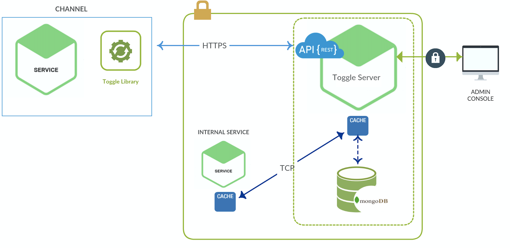
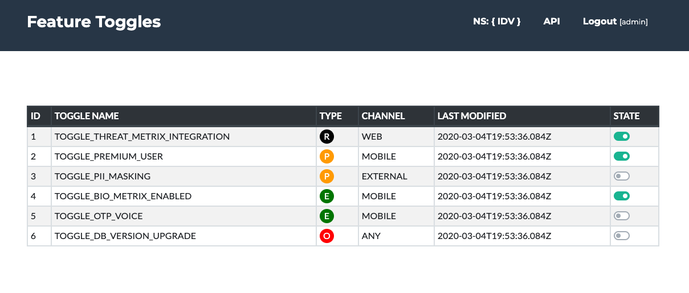

:imagesdir: ../../images

<<<

== Feature Toggles Specification

Feature Toggles (often also referred to as Feature Flags) are a powerful technique, allowing teams to modify system behavior without changing code.

=== Categories

They fall into four categories

* Release Toggles

* Experimental Toggles

* Operation Toggles

* Permission Toggles

==== Release Toggles

Release Toggles allow incomplete and un-tested code paths to be shipped to production as latent code which may never be turned on.

[source,java]
.ReleaseToggle.java
----
    if(toggleConfig.isEnabled(Toggle.TOGGLE_3DS_VERSION_UPGRADE)){

        // Code that is under development but merged to master branch
        // This toggle can be enabled dev/qa but always disabled in prod

    }
----

==== Experimental Toggles

Experiment Toggles are used to perform multivariate or `A/B testing`.

[source,java]
.ExperimentalToggle.java
----
    if(toggleConfig.isEnabled(Toggle.TOGGLE_TACTICAL_VMD)){

        // Write tactical flow logic
        // This may be enabled in prod but quickly trun off if the behaviour is not as expected
    }else{

        // Write legacy flow logic
    }
----

==== Operational Toggles

These flags are used to control operational aspects of our system's behavior.
We might introduce an Ops Toggle when rolling out a new feature which has unclear performance
implications so that system operators can disable or degrade that feature quickly in production if needed.

[source,java]
.OperationToggles.java
----
    if(toggleConfig.isEnabled(Toggle.TOGGLE_DB_VERSION_UPGRADE)){

        // send data to updraded db version
        // This is more of infrastucture related. ex: DB Switching
        // Most Ops Toggles will be relatively short-lived -
        // once confidence is gained in the operational aspects of a new feature the flag should be retired.
    }
----

==== Permission Toggles

These flags are used to change the features or product experience that certain users receive.
For example we may have a set of "premium" features which we only toggle on for our paying customers.

[source,java]
.PermissionToggle.java
----
    if(toggleConfig.isEnabled(Toggle.TOGGLE_PII_MASKING_EXTERNAL_CHANNEL) && isExternalChannel(channelId)){

        // If the request comes from external channel. mask PII information
        // This is purely request based toggle
    }
----

=== Toggle Management

Based on above discussion toggles divided into two base categories

* Static Vs Dynamic toggles

* Long-lived toggles vs transient toggles

==== Static Vs Dynamic toggles

Toggles which are making runtime routing decisions necessarily need more sophisticated Toggle Routers, along with more complex configuration for those routers.

For simple static routing decisions a toggle configuration can be a simple On or Off for each feature with a toggle router.

Experiment Toggle makes routing decisions dynamically for a given user.

image::toggles/toggles1.png[width=500, height=350]

==== Long-lived toggles vs transient toggles

Release Toggle which will be removed in a few days time then we can probably get away with a Toggle Point which does a simple if/else check on a Toggle Router.

If we're creating a new Permissioning Toggle with Toggle Points which we expect to stick around for a very long time then we certainly don't want to implement those Toggle Points by sprinkling if/else checks around indiscriminately.
We'll need to use more maintainable implementation techniques.

image::toggles/toggles2.png[width=500, height=350]

=== Toggle Router (Server)

Toggle Router which can be used to dynamically control which code path is live.
There are many ways to implement a Toggle Router,
varying from a simple `in-memory store` to a highly `sophisticated distributed system` with a fancy UI.

=== Architecture

Toggle management follows client-server architecture.

*Server*

`Toggle server` exposes simple REST APIs to manage toggles under its namespace.

namespace that represent common practice which is maintain toggles in a isolated and centralized location.

Ex: IDV , FCM are two different namespaces.

Based on dynamism of toggles that expect huge load hence it should be more reactive to handle more requests.

*Client*

Each individual service should uses client to read toggle state and maintain in it local cache, which is periodically read the latest configuration details from server.

Client can be implemented in two ways

* Simple HttpClient which reads toggle states and keeps it in memory cache and reads information from server on scheduled base.

* Distributed cache (redis/hazelcast) which will get latest data from server asynchronously via TCP/UDP protocol.

=== Toggle Server UI

Toggle server administrator UI helps RTB team to quickly update toggle state from Web user interface.
access to this UI is restricted based on the role of the users.

For example user with role `ADMIN` can able to edit toggle state. where as user with role `DEVELOPER` can able to only view the state of toggle.

=== Permissions

Following CRUD operation can be performed on toggle server which is restricted based on following Authority levels.

* ADMIN - Able change the toggle state, which will send email notification to all the members.

* DEVELOPER - Able to view toggle state but don't have permission to change the state.

* QA - Able to view toggle state but don't have permission to change the state.

=== API Operations

=== Database Schema

